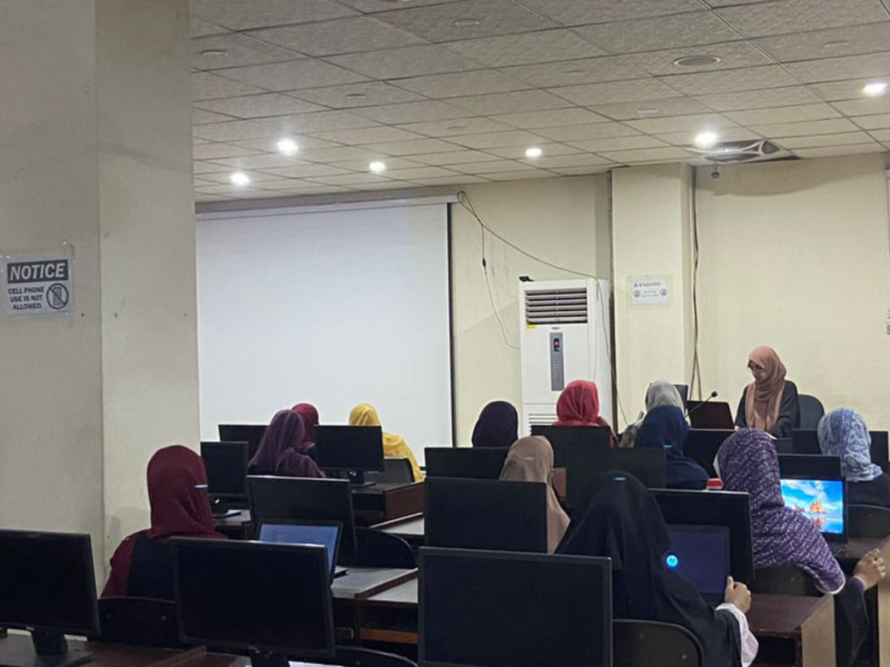

## 💫 About Me:
<h1 align="center">Hi 👋, I'm Fatima Arshad</h1>

  

- Full stack developer, completed my graduation in computer science, and recently won the gold medal in a hackathon  
- 💬 Ask me about ReactJS , NextJS , NodeJS , ExpressJS , Mongodb, PostgreSQL  
- 📚 Currently learning AWS 

## Project
🏅 Hello GPT-4 AI Challenge project [Emma Mental Health](https://lablab.ai/event/hello-gpt-4o-ai-challenge/mental-health-gpt4o/emma-mental-health)

## 🌐 Socials:
    

# 💻 Tech Stack:
                                                           

# 📊 GitHub Stats:
 

